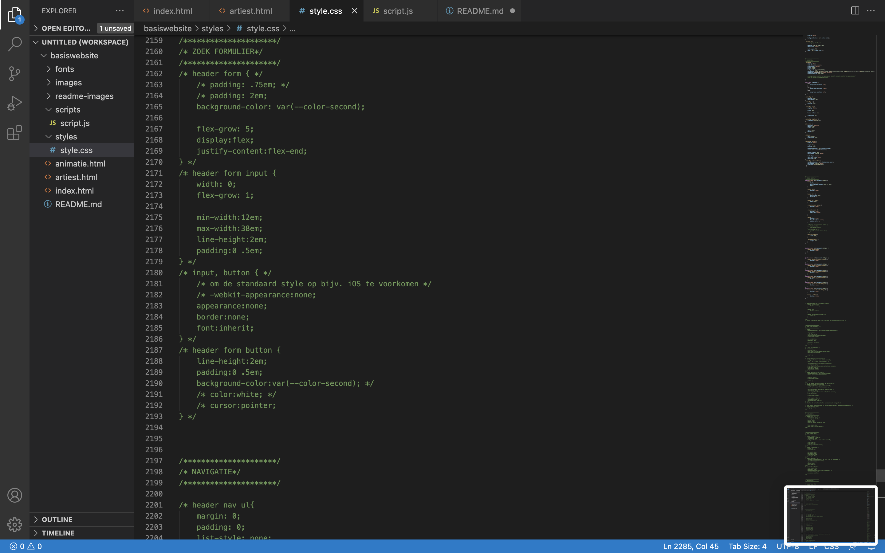

# Procesverslag
Markdown is een simpele manier om HTML te schrijven.  
Markdown cheat cheet: [Hulp bij het schrijven van Markdown](https://github.com/adam-p/markdown-here/wiki/Markdown-Cheatsheet).

Nb. De standaardstructuur en de spartaanse opmaak van de README.md zijn helemaal prima. Het gaat om de inhoud van je procesverslag. Besteedt de tijd voor pracht en praal aan je website.

Nb. Door *open* toe te voegen aan een *details* element kun je deze standaard open zetten. Fijn om dat steeds voor de relevante stuk(ken) te doen.

## Jij

  
Intro

  ### Auteur:
  Mila de Waard

  #### Je startniveau:
  Blauw

  #### Je focus:
  Responsive
 

## Je website

  
Ticketmaster

  ### Je opdracht:
  De opdracht is het uitwerken van twee verschillende pagina's van een website met 'nette' vanilla HTML, CSS en Javascript.
  Mijn gekozen website is Ticketmaster. Link: https://www.ticketmaster.nl

  #### Screenshot(s) van de eerste pagina (small screen): 
  Home screen 
  

  #### Screenshot(s) van de tweede pagina (small screen):
  Artiest  
  
 

## Week 1 - Typografie & kleur

  
In de eerste week hebben we kennisgemaakt met typografie & kleur. Daarnaast hebben we geleerd over hoe een custom property werkt.

  CCS custom property is een tool die ervoor zorgt dat een waarden die herhaaldelijk voorkomt in één keer aangepast kunt worden door de waarden op één plek te definiëren en te kunnen wijzigen.
  
  Anatomie van een CSS custom property:
  
  

  ### Wat ik heb gedaan
  

  In de eerste week een website gekozen -dit werd Ticketmaster- en daarna een klein begin gemaakt door het juiste font en kleuren in de stylesheet te zetten. Daarnaast heb ik in de HTML de eerste inhoud voor de header geplaatst.

  Font toegepast:
  
  
  Custom properties voor de kleuren gemaakt: 
  

  Klein begin gemaakt aan de header: 
  
  

## Week 2 - Toegankelijkheid + Breakdownschets

  

    In deze week heb ik het symposium over toegankelijkheid gevolgd. De kern van het verhaal is dat bij het maken en ontwikkelen van  een ontwerp toegankelijkheid erg essentieel is, zodat mensen met een permanente, tijdelijke of situatie gebaseerde beperking ook zo aangenaam mogelijk een dienst/product kunnen gebruiken. Volg de Web Content Accessibility Guidelines (WCAG), maar betrek vooral de gebruikers! Het gaat om Inlcusive Design.

    Na het symposium is mijn besef over toegankelijkheid veel groter geworden en begrijp ik beter waarom en voor wie ik een website ga ontwerpen. 

    In de les hebben we uitleg gekregen over hoe je de toegankelijkheid van je website test door middel van een screenreading. De toegankelijkheid van een website is namelijk één van de belangrijkste richtlijnen voor het maken van een website.

    Ook hebben we uitleg gekregen over het gebruik van grid en hiermee geoefend. 
    Grid is een vlakverdeling om dingen op hun plaats te leggen en niet gaan zweven op de pagina.

  
  

  

  Verder kregen we kort uitleg over media query, dit is een tool om de workflow te verbeteren. 

  Bijvoorbeeld: 

  Als de media width groter wordt dan 48em dan komen de paragrafen in 2 kolommen te staan.
  

## Toegankelijkheidstest 1/2

  

  De toegankelijkheid van de website heb ik getest met de functie voice over (VO) en keyboard only (KO). Daarnaast is er de Web Content Accessibility Guidelines (WCAG) dit is een document met richtlijnen om te voldoen aan de toegankelijkheid van een website. Echter als deze richtlijnen allemaal zijn behaald betekent het nog steeds niet dat je website volledig toegankelijk is, de gebruiker speelt ook nog een essentiële rol.
  

  ### Bevindingen
  -	VO en KO wordt in het Nederlands gegeven, maar met een Engels accent.
  -	De VO begint met “Link, doorgaan naar inhoud”, dit is niet zichtbaar. Bij de KO komt die wel tevoorschijn.
  -	Inlog/registreren wordt volgens de VO en KO als button gekemerkt, maar het hoort een link te zijn, want je gaat naar een andere pagina.
  -	H1 is het beeldmerk en geen titel op de home pagina. Op de artiesten pagina is er wel een H1 titel en is het beeldmerk alleen een link.
  -	“Heading level 1, Ticketmaster” (h1) niet zichtbaar, maar wordt wel genoemd na de navigatie.
  -	“Heading level 2, Highlights” (h2) niet zichtbaar, maar wordt wel genoemd na h1. 
  -	Andere h2 koppen “Recent bekeken”, “Populair” en “Aanbevolen” zijn wel zichtbaar en worden ook genoemd.
  -	Veel heading 3 (h3) gebruikt.
  -	Veel links gebruikt. Bijna elke h3 is een link.
  -	De h2 footer-navigatie is niet zichtbaar, maar met de KO wordt die heel minimaal getoond. 
  -	Je kunt met KO niet makkelijk naar een bepaald kopje, want dat moet je alle andere inhoudselementen met dezelfde functie langsgaan.
  -	De VO en KO laten geen paragrafen (p) zien.

 

## Breakdownschets

  

  Een breakdownschets maken van een website pagina geeft je overzicht van alle html-elementen waaruit de website is opgebouwd.
  

  ### De hele home pagina: 
  

  ### Dynamisch deel menu: 
  

  ### Dynamisch deel footer: 
  

  ### De hele artiest(en) pagina: 
  

  ### Wat ik heb gedaan
  

  Eerste twee weken ben ik bezig geweest met het vullen van de html inhoud. Door het volgen van de breakdownschets en door alle afbeeldingen en iconen te verzamelen.

  

  Header aangevuld.
  

  Een deel van de main inhoud.
  
  

## Week 3 - Flexbox + Voortgang 1

  

  De les van deze week ging over flexbox. Dit gebruik je om items (blok elementen) te “flexen”, oftewel hoe je ze ten opzichte van elkaar neer wil zetten. Van nature staan blok elementen onder elkaar en door te “flexen” kun je dit veranderen. Verder bestaat een flexbox uit een parent (flex-container) en een child (flex-item). Bijvoorbeeld:

  

  Ook heb ik vanuit de flexbox presentatie uitleg gekregen hoe je een combinatie van een foto en een tekst een link kan maken in html.

    a href= “#”
      <h3></h3>
      <h4></h4>
      
    /a
  

## Voortgang 1

  

  Het voortgangsgesprek ging vooral over de breakdownschets. De student-assistent heeft mijn vragen kunnen beantwoorden, waardoor ik als gevolg verder kon met het maken van de HTML inhoud. Verder heb ik uitleg gekregen hoe ik gemakkelijk images kan downloaden van de website.
  

  ### Stand van zaken
  
 
  Buiten de les ben ik bezig geweest met het uitbreiden, verbeteren van de header. Ook heb ik een begin gemaakt met het verzamelen van zo veel mogelijk inhoud voor de main en footer.
  

  

  Search bar in de header geplaatst.
  
  (Bron: 4)

  Main inhoud, waar ik van een image en tekst één link heb kunnen maken.
  

  
  (Bron: presentatie over flexbox).

  Allereerste footer inhoud. Niet veel, alleen kopjes. Blijkbaar twijfelde ik nog over hoe ik de links erin moest zetten.
  

  

## Week 4 - JS 3-stap

  

  Deze week ging over JavaScript. JavaScript helpt om nog efficiënter code te schrijven en om html-elementen met elkaar te laten werken.
  Door middel van document object model (DOM) refereer je naar het html-element. En om de CSS erbij te betrekken doe je dat met de document.querySelector in de JS, die selecteert het overeenkomende element uit de CSS. Daarnaast kun je met de add.Eventlistener een functie laten uitvoeren. Als laatst kun je dit controleren in de console van een browser, die kijkt voor eventuele fouten. Voorbeeld:

  
  (Bron: 1)
  

  ### Wat ik heb gedaan
  

  Na dat ik de eerste HTML pagina helemaal inhoud heb gegeven kon ik een begin maken met de CSS. Echter had ik deze week niet heel veel gedaan.

  Eerste CSS voor de header:
  

  Waar ik voornamelijk vastliep hoe de grid kon toe passen op verschilldende schermbreedte. Eigenlijk dat het responisve werd. Daarnaast vond ik het lastig om überhaupt op de juiste elementen te komen.
  

## Week 5 - Positioneren + Voortgang 2

  

  Deze les ging over positioneren. Met positioneren wil je een element op een specifieke plek in een parent of in een scherm zetten. Er zijn 5 flavours of position:

  -	Position: static
    De standaard waarde voor positioneren en wordt gebaseerd op de plaats in de HTML door top, right, bottom, left. Ook wel flow lay-out genoemd.
  -	Position: relative
    Behoudt een element in de flow.
  -	Position: absolute
    Het element gaat uit de flow, waardoor je elementen los kunt positioneren.
  - Position: fixed
    Het element gaat uit de flow, maar het blijft wel op een vaste plek staan als je scrollt.
  - Position: sticky
    Behoudt een element in de flow. En als het element uit beeld schuift blijft die plakken

    ### Wat ik heb gedaan
    Deze week vooral bezig geweest met het stylen van de hele pagina, met name de navigatie. Ook geleerd hoe je items alleen voor de screenreader kan laten lezen. 

    Sreenreader only:
    
    (Bron: 2)

    CSS voor de main:
    
  

## Voortgang 2

  

  Tijdens het voortgangsgesprek was mijn HTML in principe op orde tot zo ver, tenminste het zag er goed uit. Verder moest ik vooral de oefeningen erbij pakken en verder aan de slag met stylen.
  

  ### Stand van zaken
  De HTML van eerste pagina redelijk op orde. Nu een kwestie van ertoe aanzetten, maar dat vond ik best moeilijk.
  Wat ik moeilijk vond was dat als je uitleg opzoekte het vaak met elementen werd uitgelegd, zoals divs, die je niet mag gebruiken, dus dan loop je snel vast en wist ik gewoon niet welk element ik dan kon gebruiken. Heel erg zoekend dus.

  Uiteindelijk ben ik stap voor stap vanuit de oefeningen bepaalde onderdelen gaan stylen. Hieronder is oude code te zien, niet dat het verkeerd was. Later is het allemaal aangepast om wat overzichtelijker en specifieker te kunnen stylen.
 
  CSS header:
  
  
  CSS zoek fomulier:
  

  CSS navigatie:
  

  (Bron: Flexbox oefening 2) 
  

## Week 6 - Animeren

  

  Voor de opdracht moet er een animatie in komen, dus hebben we kort uitleg gekregen hoe je zo'n animatie maakt. Verder aan de website gewerkt in de les. 

  
  

## Week 7 - States + Voortgang 3

  

    Als je nadenkt over de states, dan denk je na over welke styling correct is voor het element waarvoor het gebruikt moet worden. 
    Dus een link moet eruit zien als een link, een button als een button en zo door.
  

## Voortgang 3

  

  Voor deze week is er niet mega veel veranderd aan het proces. Alles wat ik tot noe toe had was niet verkeerd, maar de manier van stylen had ik erg moeilijk voor mezelf gemaakt. Als goude tip dat ik kreeg moest ik per section gaan stylen. Het werkt veel makkelijker omdat je specifieker elementen kunt benoemen.

  Kortom, de code omgooien en nog concreter voor jezelf maken.
  

  ### Stand van zaken
  Tijdens de kerstvakantie vond ik het erg lastig om aan het vak Frontend Developemnt te zitten. Ook omdat het even een chaos was geworden en ik niet wist waar ik weer moest beginnen, dit kwam uiteraard doordat ik niet altijd met section werkte. Overigens had ik dat niet gebruikt, omdat ik dacht dat er geen classes gebruikt mocht worden, maar daarvoor dus wel.

## Week 8 - Toegankelijkheid

  

  Deze week heb ik buiten de lessen om flink aan de opdracht gewerkt. De header en de footer heb ik helemaal opnieuw gemaakt, omdat het oude gewoon niet meer duidelijk was om vanuit verder uit te werken, het was zeker niet verkeerd, maar het was gewoon chaos.

  Daarnaast zoveel mogelijk "af" proberen te krijgen om de tweede toegankelijkheidstest te doen.
  

## Toegankelijkheidstest 2/2

  

  De toegankelijkheid van de website heb ik  net zoals vorige keer getest met de functie voice over (VO) en keyboard only (KO). Daarnaast is 
  er de Web Content Accessibility Guidelines (WCAG) dit is een document met richtlijnen om te voldoen aan de toegankelijkheid van een 
  website. Echter als deze richtlijnen allemaal zijn behaald betekent het nog steeds niet dat je website volledig toegankelijk is, de 
  gebruiker speelt ook nog een essentiële rol.
  

  ### Bevindingen
  -	Bij bepaalde elementen werden de titels/benaming herhaaldelijk genoemd, kwam omdat ik het dus dubbel of hetzelfde had genoemd.
  - Met de KO kom ik overal langs.
  - VO en KO wordt in het Nederlands gegeven, maar met een Engels accent. Opzich wel te volgen.
  - De eerste link begint ook bij de H1. Bij de echte webiste was dat niet zo, daar werd de titel overgeslagen.
  - De VO benoemd alle links met titel/beschrijving.
  - Omdat de H3 in een link ook zit, gaat de KO ook langs alle links.

## Week 9 - Eindgesprek

  

    Hoe ik frontend development heb ervaren? Als 1 grote puzzel. 

    De theorie werd goed uitgelegd tijdens de lessen. De oefingen waren zeker handig! En uiteindelijk begreep ik de stof, maar het kwam allemaal zo snel. Dan ben je net bezig met iets en dan krijg je weer nieuwe stof erbij voor wat je later pas nodig hebt. Hierdoor "vergat" je weer wat er eigenlijk nog moest gebeuren. Gelukkig was de stof allemaal makkelijk terug te vinden.

    Omdat ik voor me idee wel echt van nul begon was sowieso het op starten een ding. Dat je bij de eerste regel die je moet schrijven al dacht: "Ja wat moet er komen?" Dit duurde dus en was niet heel efficiënt werken. Telkens een beetje zoekend geweest.

    Uiteindelijk gedaan wat ik kon doen. Veel nieuwe dingen geleerd. Met name de handigheid, gewoon de omgang met alles wat met visual code, het schrijven van de code te maken heeft. 
    
    Wat ik nu anders had willen doen?
    De aanpak van het maken van deze opdracht. Veel tijd verloren onderzoeken, hoe, wat en waar. Ook goed vakantie gehouden, maar voor wat ik heb ben ik tevreden. Al beter dan eerst.
  

  ### Je uitkomst - karakteristiek screenshots:
  De home pagina:
  

  De artiesten pagina:
  

  ### Dit ging goed/Heb ik geleerd: 
  Ik heb geleerd om met media query te werken, om responsiveness toe te passen.
  
  Als het scherm 450px breed is dan veranderd bijvoorbeeld de footer van diplay:grid naar display:flex;.

  Ik heb beter idee gekregen hoe een grid werkt.
  
  Om een item juist te plaatsen in een grid geef je dat aan doormiddel van een grid-template-columns en grid-template-rows verhoudingen en daarna geef je per item aan in welke grid-column en grid-row die moet zitten.

  Meer handigheid gekregen in de manier van code lezen, opzoeken, terug te vinden en aanpassen. Namelijk dat je vanuit het inspecteren heel gemakkelijke en element kunt vinden en zelfs ter plaatse kunt aanpassen, waardoor daarna in je code kunt wijzigen. Verder bepaalde shortcuts geleerd.

  Ik heb geleerd hoe je een hamburger menu kunt maken met onder andere JavasScript.
  

  De hover functie leren kennen. Handig om bepaalde items te laten opvallen.
  

  Iets geleerd over de scroll functie.
  

  Geleerd hoe een animatie werkt.
  
  (Bron 3, voor achtergrond)
  

  ### Dit was lastig/Is niet gelukt:
  Ondanks dat de hover bij sommige elementen wel werkte, is het niet bij alle elementen gelukt. 
  

  Ook bij de recent-events hoorde er nog afbeeldingen bij, maar dat lukte niet.
   

  In de laatste week heb ik een poging gedaan om de tweede pagina te maken. Bijna de volledige inhoud staat er in, maar niet alles gestyld zoals het hoort qua uitstraling.
  

## Bronnenlijst

  
continu bijhouden terwijl je werkt

  1. Bron 1: Coyier, C. (2016, November 25). #150: Hey designers, if you only know one thing about JavaScript, this is what I would recommend | CSS-Tricks. CSS-Tricks. https://css-tricks.com/video-screencasts/150-hey-designers-know-one-thing-javascript-recommend/
  2. Bron 2: Coyier, C. (2021, February 23). Inclusively hidden | CSS-Tricks. CSS-Tricks. https://css-tricks.com/inclusively-hidden/
  3. Bron 3: CSS Gradient — generator, maker, and background. (n.d.). CSS Gradient. https://cssgradient.io/
  4. Bron 4: GreatStack. (2022, January 28). How To Make A Search Bar Using HTML And CSS In 10 Just Minutes [Video]. YouTube. https://www.youtube.com/watch?v=9hnJsNIBq1g
  5. Bron 5: How to Add an HTML Button that Acts Like a Link. (n.d.). https://www.w3docs.com/snippets/html/how-to-create-an-html-button-that-acts-like-a-link.html

  Verder veel gebruik gemaakt van de oefingen uit codepen.

