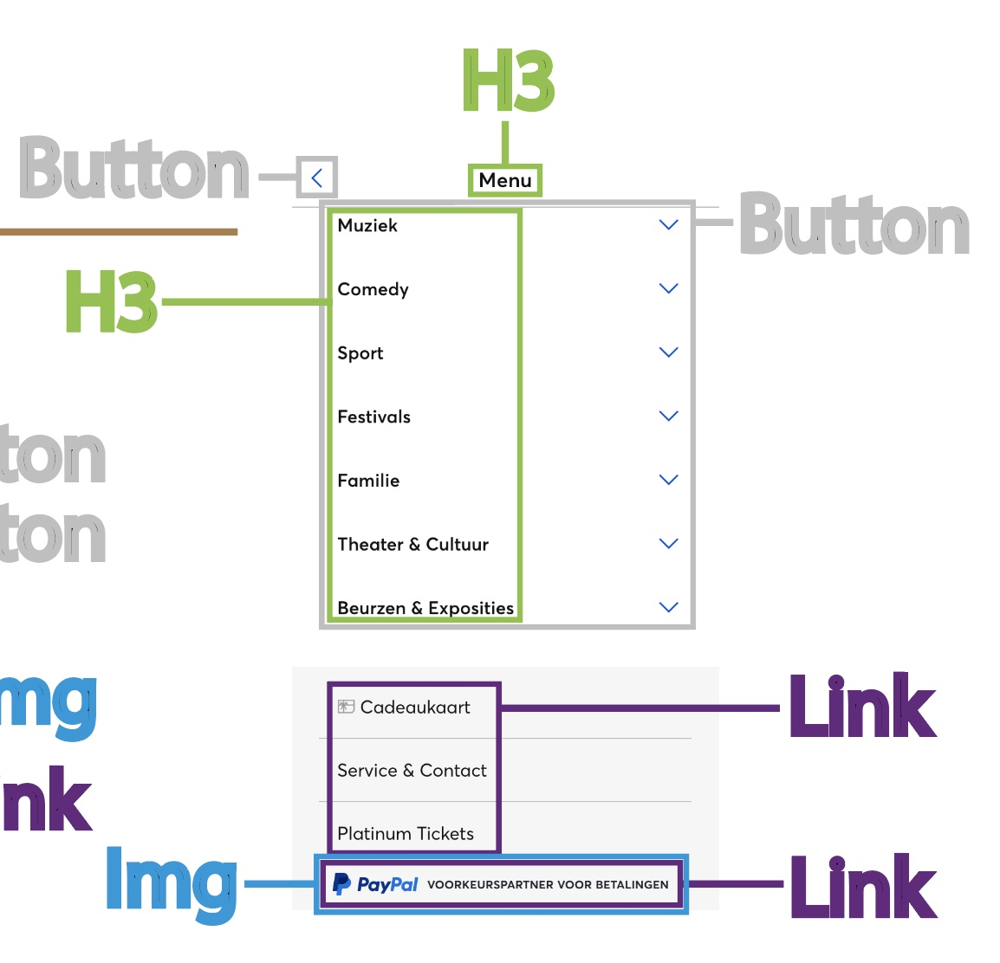

# Procesverslag
Markdown is een simpele manier om HTML te schrijven.  
Markdown cheat cheet: [Hulp bij het schrijven van Markdown](https://github.com/adam-p/markdown-here/wiki/Markdown-Cheatsheet).

Nb. De standaardstructuur en de spartaanse opmaak van de README.md zijn helemaal prima. Het gaat om de inhoud van je procesverslag. Besteedt de tijd voor pracht en praal aan je website.

Nb. Door *open* toe te voegen aan een *details* element kun je deze standaard open zetten. Fijn om dat steeds voor de relevante stuk(ken) te doen.

## Jij

  
Intro

  ### Auteur:
  Mila de Waard

  #### Je startniveau:
  Blauw

  #### Je focus:
  Responsive
 

## Je website

  
Ticketmaster

  ### Je opdracht:
  De opdracht is het uitwerken van twee verschillende pagina's van een website met 'nette' vanilla HTML, CSS en Javascript.
  Mijn gekozen website is Ticketmaster. Link: https://www.ticketmaster.nl

  #### Screenshot(s) van de eerste pagina (small screen): 
  Home screen 
  

  #### Screenshot(s) van de tweede pagina (small screen):
  Artiest  
  
 

## Week 1 - Typografie & kleur

  
In de eerste week hebben we kennisgemaakt met typografie & kleur. Daarnaast hebben we geleerd over hoe een custom property werkt.

  CCS custom property is een tool die ervoor zorgt dat een waarden die herhaaldelijk voorkomt in één keer aangepast kunt worden door de waarden op één plek te definiëren en te kunnen wijzigen.
  
  Anatomie van een CSS custom property:
  
  

  ### Wat ik heb gedaan
  

  In de eerste week een website gekozen -dit werd Ticketmaster- en daarna een klein begin gemaakt door het juiste font en kleuren in de stylesheet te zetten. Daarnaast heb ik in de HTML de eerste inhoud voor de header geplaatst.

  Font toegepast:
  
  
  Custom properties voor de kleuren gemaakt: 
  

  Klein begin gemaakt aan de header: 
  
  

## Week 2 - Toegankelijkheid + Breakdownschets

  

    In deze week heb ik het symposium over toegankelijkheid gevolgd. De kern van het verhaal is dat bij het maken en ontwikkelen van  een ontwerp toegankelijkheid erg essentieel is, zodat mensen met een permanente, tijdelijke of situatie gebaseerde beperking ook zo aangenaam mogelijk een dienst/product kunnen gebruiken. Volg de Web Content Accessibility Guidelines (WCAG), maar betrek vooral de gebruikers! Het gaat om Inlcusive Design.

    Na het symposium is mijn besef over toegankelijkheid veel groter geworden en begrijp ik beter waarom en voor wie ik een website ga ontwerpen. 

    In de les hebben we uitleg gekregen over hoe je de toegankelijkheid van je website test door middel van een screenreading. De toegankelijkheid van een website is namelijk één van de belangrijkste richtlijnen voor het maken van een website.

    Ook hebben we uitleg gekregen over het gebruik van grid en hiermee geoefend. 
    Grid is een vlakverdeling om dingen op hun plaats te leggen en niet gaan zweven op de pagina.

  
  

  

  Verder kregen we kort uitleg over media query, dit is een tool om de workflow te verbeteren. Bijvoorbeeld: 

  

  Als de media width groter wordt dan 48em dan komen de paragrafen in 2 kolommen te staan.
  

## Toegankelijkheidstest 1/2

  

  De toegankelijkheid van de website heb ik getest met de functie voice over (VO) en keyboard only (KO). Daarnaast is er de Web Content Accessibility Guidelines (WCAG) dit is een document met richtlijnen om te voldoen aan de toegankelijkheid van een website. Echter als deze richtlijnen allemaal zijn behaald betekent het nog steeds niet dat je website volledig toegankelijk is, de gebruiker speelt ook nog een essentiële rol.
  

  ### Bevindingen
  -	VO en KO wordt in het Nederlands gegeven, maar met een Engels accent.
  -	De VO begint met “Link, doorgaan naar inhoud”, dit is niet zichtbaar. Bij de KO komt die wel tevoorschijn.
  -	Inlog/registreren wordt volgens de VO en KO als button gekemerkt, maar het hoort een link te zijn, want je gaat naar een andere pagina.
  -	H1 is het beeldmerk en geen titel op de home pagina. Op de artiesten pagina is er wel een H1 titel en is het beeldmerk alleen een link.
  -	“Heading level 1, Ticketmaster” (h1) niet zichtbaar, maar wordt wel genoemd na de navigatie.
  -	“Heading level 2, Highlights” (h2) niet zichtbaar, maar wordt wel genoemd na h1. 
  -	Andere h2 koppen “Recent bekeken”, “Populair” en “Aanbevolen” zijn wel zichtbaar en worden ook genoemd.
  -	Veel heading 3 (h3) gebruikt.
  -	Veel links gebruikt. Bijna elke h3 is een link.
  -	De h2 footer-navigatie is niet zichtbaar, maar met de KO wordt die heel minimaal getoond. 
  -	Je kunt met KO niet makkelijk naar een bepaald kopje, want dat moet je alle andere inhoudselementen met dezelfde functie langsgaan.
  -	De VO en KO laten geen paragrafen (p) zien.

  ### Web Content Accessibilty Guidelines (WCAG)
  Moet nog tekst komen.

 

## Breakdownschets

  

  Een breakdownschets maken van een website pagina geeft je overzicht van alle html-elementen waaruit de website is opgebouwd.
  

  ### De hele home pagina: 
  

  ### Dynamisch deel menu: 
  

  ### Dynamisch deel footer: 
  

  ### De hele artiest(en) pagina: 
  

  ### Wat ik heb gedaan
  

  Eerste twee weken ben ik bezig geweest met het vullen van de html inhoud. Door het volgen van de breakdownschets en door alle afbeeldingen en iconen te verzamelen.

  

  Header aangevuld.
  

  Een deel van de main inhoud.
  
  

## Week 3 - Flexbox + Voortgang 1

  

  De les van deze week ging over flexbox. Dit gebruik je om items (blok elementen) te “flexen”, oftewel hoe je ze ten opzichte van elkaar neer wil zetten. Van nature staan blok elementen onder elkaar en door te “flexen” kun je dit veranderen. Verder bestaat een flexbox uit een parent (flex-container) en een child (flex-item). Bijvoorbeeld:

  

  Ook heb ik vanuit de flexbox presentatie uitleg gekregen hoe je een combinatie van een foto en een tekst een link kan maken in html.

    a href= “#”
      <h3></h3>
      <h4></h4>
      
    /a
  

## Voortgang 1

  

  Het voortgangsgesprek ging vooral over de breakdownschets. De student-assistent heeft mijn vragen kunnen beantwoorden, waardoor ik als gevolg verder kon met het maken van de HTML inhoud. Verder heb ik uitleg gekregen hoe ik gemakkelijk images kan downloaden van de website.
  

  ### Stand van zaken
  
 
  Buiten de les ben ik bezig geweest met het uitbreiden, verbeteren van de header. Ook heb ik een begin gemaakt met het verzamelen van zo veel mogelijk inhoud voor de main en footer.
  

  

  Search bar in de header geplaatst.
  
  (Bron: https://www.youtube.com/watch?v=9hnJsNIBq1g)

  Main inhoud, waar ik van een image en tekst één link heb kunnen maken.
  

  
  (Bron: presentatie over flexbox).

  Allereerste footer inhoud. Niet veel, alleen kopjes. Blijkbaar twijfelde ik nog over hoe ik de links erin moest zetten.
  
  

## Week 4 - JS 3-stap

  

  Deze week ging over JavaScript. JavaScript helpt om nog efficiënter code te schrijven en om html-elementen met elkaar te laten werken.
  Door middel van document object model (DOM) refereer je naar het html-element. En om de CSS erbij te betrekken doe je dat met de document.querySelector in de JS, die selecteert het overeenkomende element uit de CSS. Daarnaast kun je met de add.Eventlistener een functie laten uitvoeren. Als laatst kun je dit controleren in de console van een browser, die kijkt voor eventuele fouten. Voorbeeld:

  
  Bron: https://css-tricks.com/video-screencasts/150-hey-designers-know-one-thing-javascript-recommend/
  

  ### Wat ik heb gedaan
  

  Na dat ik de eerste HTML pagina helemaal inhoud heb gegeven kon ik een begin maken met de CSS. Echter had ik deze week niet heel veel gedaan.

  Eerste CSS voor de header en main:
  

  

  Waar ik voornamelijk vastliep hoe de grid kon toe passen op verschilldende schermbreedte. Eigenlijk dat het responisve werd. Daarnaast vond ik het lastig om uüberhaupt op de juiste elementen te komen.
  

## Week 5 - Positioneren + Voortgang 2

  
Deze les ging over positioneren. Met positioneren wil je een element op een specifieke plek in een parent of in een scherm zetten. Er zijn 5 flavours of position:

  -	Position: static
    De standaard waarde voor positioneren en wordt gebaseerd op de plaats in de html door top, right, bottom, left. Ook wel flow lay-out genoemd.
  -	Position: relative
    Behoudt een element in de flow.
  -	Position: absolute
  

## Voortgang 2

  

  ### Stand van zaken
  hier dit ging goed & dit was lastig (neem ook screenshots op van delen van je website en code)

  ### Agenda voor meeting
  samen met je groepje opstellen

  | student 1      | student 2          | student 3    | student 4        |
  | ---            | ---                | ---          | ---              |
  | dit bespreken  | en dit             | en ik dit    | en dan ik dat    |
  | en dat ook nog | dit als er tijd is | nog een punt | dit wil ik zeker |
  | ...            | ...                | ...          | ...              |

  ### Verslag van meeting
  hier na afloop snel de uitkomsten van de meeting vastleggen

  - punt 1
  - punt 2
  - nog een punt
- ...

## Week 6 - Animeren

  

  

## Week 7 - States + Voortgang 3

  

  

## Voortgang 3

  

  ### Stand van zaken
  hier dit ging goed & dit was lastig (neem ook screenshots op van delen van je website en code)

  ### Agenda voor meeting
  samen met je groepje opstellen

  | student 1      | student 2          | student 3    | student 4        |
  | ---            | ---                | ---          | ---              |
  | dit bespreken  | en dit             | en ik dit    | en dan ik dat    |
  | en dat ook nog | dit als er tijd is | nog een punt | dit wil ik zeker |
  | ...            | ...                | ...          | ...              |

  ### Verslag van meeting
  hier na afloop snel de uitkomsten van de meeting vastleggen

  - punt 1
  - punt 2
  - nog een punt
  - ...

## Week 8 - Toegankelijkheid

  

  

## Toegankelijkheidstest 2/2

  

  ### Bevindingen
  Lijst met je bevindingen die in de test naar voren kwamen (geef ook aan wat er verbeterd is):

## Week 9 - Eindgesprek

  

  ### Je uitkomst - karakteristiek screenshots:
  

  ### Dit ging goed/Heb ik geleerd: 
  Korte omschrijving met plaatjes

  

  ### Dit was lastig/Is niet gelukt:
  Korte omschrijving met plaatjes

  

## Bronnenlijst

  
continu bijhouden terwijl je werkt

  Nb. Wees specifiek ('css-tricks' als bron is bijv. niet specifiek genoeg). 
  Nb. ChatGpT en andere AI horen er ook bij.
  Nb. Vermeld de bronnen ook in je code.

  1. bron 1
  2. bron 2
  3. ...

